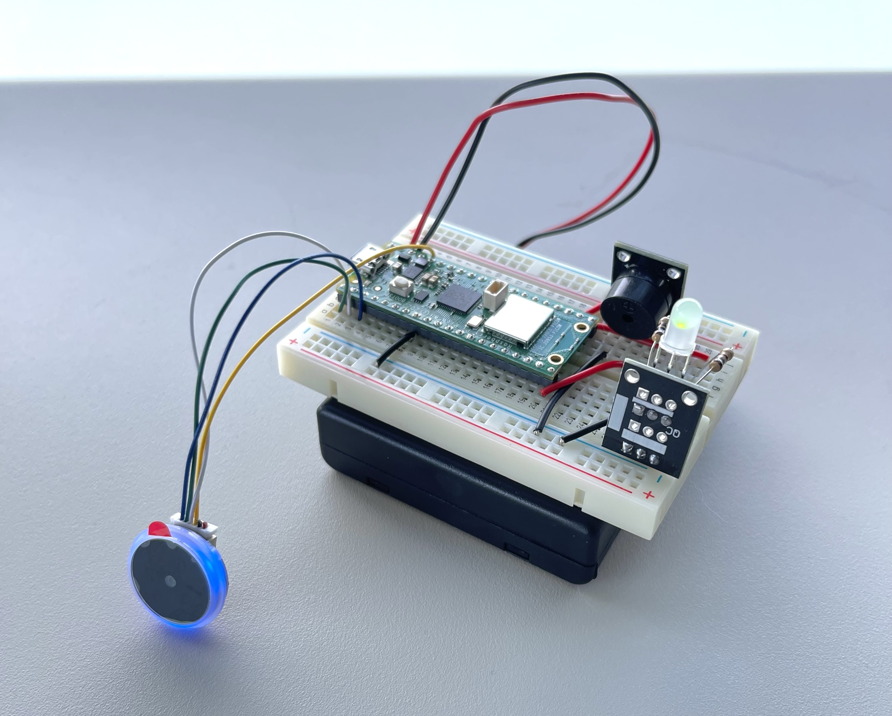

# Book scanner

Vilhelm Fontell (vf222it)

## Introduction

This tutorial describes how to build a scanner for quickly adding information about books to a custom made book organization system. The user scans the barcode of a book, and data about the book is fetched from Google Books and Open Library based on the ISBN number. The data is then automatically inserted into a Node-Red dashboard where the user can check the information and complete it or change it if something is wrong or missing. The user then saves the book, which is inserted into the book system via an API call.

Estimated time to complete this tutorial is 4-8 hours.

### About the book system

The book organisation system previously mentioned is called [Bokportalen](https://github.com/villetf/bokportalen/tree/dev), which is a web system that I am currently building in Node.js and Angular. The purpose of Bokportalen is to create a complete database of all the books that you own and make it possible to view statistics and keep track of which books you own. Even though it is theoretically possible to set up Bokportalen yourself, it would require a lot of configuration, and would not be fully functional since the work is not done yet.

However, it would be possible to modify the API calls to suit any other book system, such as Goodreads or Hardcover. Since the final API calls to post the book are just a fraction of the project, it should not be too much work.

## Objective

I chose this project because manually adding books to the system is a lot of work, and I have been thinking that there should be a way to make it faster and easier. When using the scanner, the time to add books is significantly reduced, and the risk of errors decreases. If you use the scanner and add all the books you own, you will not only have an overview of the books you own, but you can also get an insight of how your collection is divided, for example by language, genre, nationality and gender of authors, and so on.

## Material

The following material is required to build the project:

| Component | Purpose | Cost | Alternative |
| --------- | ------- | ---- | ----------- |
| Raspberry Pi Pico WH | Main MCU | 99 SEK [Electrokit](https://www.electrokit.com/en/raspberry-pi-pico-wh) | Any other MCU that supports UART |
| UART Barcode reader | Scanning book barcodes | 359 SEK [Electrokit](https://www.electrokit.com/en/streckkods-qr-kodlasare-uart) | Any other barcode reader that can be connected to a MCU (make sure to check the specifications for what barcode types are supported) |
| Breadboard 400 tie-points | Connect everything | 49 sek [Electrokit](https://www.electrokit.com/en/kopplingsdack-400-anslutningar) | Any other breadboard, or a soldered solution for a more durable install |
| Passive piezo buzzer | Give the user audial feedback, for example when scanning a book | 29 SEK [Electrokit](https://www.electrokit.com/en/piezohogtalare-passiv) | Any other buzzer, for example the active equivalent |
| LED module Red/Green 5mm | Give the user visual feedback on the state of the scanner | 18 SEK [Electrokit](https://www.electrokit.com/en/led-modul-rod/gron-5mm) | Separate green and red lights |
| Hook-up wire AWG24 red, 1 metre | Connect everything nicely | 6 SEK [Electrokit](https://www.electrokit.com/en/kopplingstrad-awg24-flertradig-rod-/m) | Regular dupont wires |
| Hook-up wire AWG24 black, 1 metre | Connect everything nicely | 6 SEK [Electrokit](https://www.electrokit.com/en/kopplingstrad-awg24-flertradig-svart-/m) | Regular dupont wires |
| Resistor carbon film 0.25W 180ohm | Connect the red part of the LED module | 1 SEK [Electrokit](https://www.electrokit.com/en/motstand-kolfilm-0.25w-180ohm-180r) | A 330ohm resistor will also work, but with a less bright red
| Resistor carbon film 0.25W 100ohm | Connect the green part of the LED module | 1 SEK [Electrokit](https://www.electrokit.com/en/motstand-kolfilm-0.25w-180ohm-180r) | You can parallell connect three 330ohm resistors with about the same result |
| Battery holder 4x AA with on/off switch | Holding the batteries, turning the unit on and off | 30 SEK [Electrokit](https://www.electrokit.com/en/batterihallare-4xaa-box-brytare-sladd) | USB, or any other power source |
| 4x LADDA AA 1.2V 2450 mAh rechargeable batteries | Powering the unit | 99 SEK [IKEA](https://www.ikea.com/se/en/p/ladda-rechargeable-battery-hr06-aa-1-2v-50504692/) | Any other 1,2V AA rechargeable batteries, alternatively 3x 1,5V non-rechargeable batteries (requires the battery holder to be replaced with one for 3 batteries) |

Total cost: 726 SEK

## Computer setup

As my IDE, I am using Visual Studio Code (VSCode) together with the MicroPico plugin. Version control is done via Git with Github. To get your Pico and your IDE ready for development, use the following steps:

1. In Visual Studio Code, install the [MicroPico](https://marketplace.visualstudio.com/items?itemName=paulober.pico-w-go) plugin. Install the recommended additional plugins.
2. Clone this project (or download it as a zip) and open the folder in VSCode.
3. In the project folder, create a folder named "config", and inside it, create a file named keys.py. Fill it with the follwing content:

   ```python
   WIFI_SSID = 'Your_network_name'
   WIFI_PASS = 'Your_network_password'

   # MQTT server's configuration
   MQTT_SERVER = "ip_of_mosquitto_server"
   MQTT_PORT = 1883
   MQTT_CLIENT_ID = "id-1223"
   ```

4. Connect a micro-USB cable to your Pico.
5. While holding the BOOTSEL button on your Pico, insert the other end of the USB cable into your computer. Your Pico will connect as an external drive to your computer.
6. Download [this file](https://micropython.org/resources/firmware/RPI_PICO_W-20250415-v1.25.0.uf2) (for the RP2040) and place it on your Pico. The Pico will disappear as an external drive.
7. Unplug the Pico and plug it back in. It should connect automatically to MicroPico, and you should see a green line in the terminal with some info about your Pico.
8. Press Cmd/Ctrl+Shift+P and type "micropico". Select the option "MicroPico: Upload project to Pico". The project will be copied to the Pico.
9. Open the file main.py and click "Start" in the lower left bar of VSCode. The project will run and, if everything on the board is correctly connected, you will hear three beeps from the buzzer if the network connection was successful. The scanner is now ready to scan.

## Putting everything together

This circuit diagram describes how to connect your components:


Note that:
- The barcode scanner comes with a connector that connect to six wires, but just four of them are used (3.3V, GND, RX, TX). Therefore, it might be useful to fasten the two unconnected wires with a ziptie, or just cut them.
- The four wires from the camera may vary in color, so always check the [documentation](https://www.waveshare.com/wiki/Barcode_Scanner_Module_(D)) for the camera to make sure that you connect the right wires.
- The ground for the scanner is connected directly to the Pico's ground. The reason for this is that I experienced some interference noise from the buzzer when having the scanner's ground connected to the horizontal ground row.

### Electrical calculations

The table describes the power consumption for the components:

| Component | Power consumption |
| --------- | ----------------- |
| Pico | ~50 mA |
| Barcode scanner | 120 mA |
| LED | 10 mA |
| Buzzer | Negligible consumption, since it only makes very short sounds |

This sums up to a total consumption of about 180 mA.

The four AA batteries have a capacity of 2450 mAh each, adding up to a total of 9800 mAh. But since the batteries are connected in series and not parallell, we only get 2450 mAh at 4.8V for all of the four batteries.

We divide the battery capacity with the power consumption:

2450 / 180 = 13.6

This means that with fully charged batteries, the appliance should be able to run for at least 13 hours.

## Platform

When the user have scanned a book, it is important that the fetched data can be shown, corrected if wrong, and manually confirmed before it is saved to the database. If the data would be saved immediately, you could end up with inaccurate or incomplete data in the database. This also makes it possible to fill in fields that cannot be fetched from the API. For example, original language is not somthing that the API:s return, so that always has to be filled in manually, or left empty.

To accomplish this I used Node-red, which is a tool used for low-code visual programming. Together with the palette (node-red:s word for a module) node-red-dashboard, it has support for creating interactive dashboards. Node-red is a self-hosted solution, and I run it in a Docker environment (using [this container](https://hub.docker.com/r/nodered/node-red)). 

Node-red is very suitable for this kind of project since it, unless other platforms like Adafruit and Grafana, supports that the user can modify the data before sending it forward in the flow. Since it is primarly a low-code programming tool and not only a visulization tool, it also has a lot of support for programatically modifying the data in a lot of different ways. This means that it would be simple to, for example, rebuild the flow for a different API, as mentioned in the introduction.

The JSON file for this Node-red project is available [here](./node-red/flows.json). 

### MQTT broker

The book data sent from the Pico is sent using MQTT, a lightweight network protocol built for small data loads, such as IoT units. It uses a publish-subscribe system, which means that we need to have an MQTT broker on the network. I use Mosquitto, but any broker would work. In my setup, Mosquitto is also run as a Docker container (using [this container](https://hub.docker.com/_/eclipse-mosquitto)), which makes it very easy and fast so set up.

## The code

The Micropython code that is being run on the Pico is found in this Github repository. The chart below describes the flow of the code:


In order to make the code work, you have to add a folder named `config` with a file named `keys.py` with the following content:

```python
   WIFI_SSID = 'wifi_name'
   WIFI_PASS = 'wifi_password'

   # MQTT server's configuration
   MQTT_SERVER = "ip_to_mqtt_server"
   MQTT_PORT = "port_to_mqtt_broker_(usually 1883)"
   MQTT_CLIENT_ID = "id-1223"
```

Replace the values with your credentials.

When it comes to project structure, you may notice that there is a lot of files in the lib folder. Of these, only mqtt.py (which is the library used to connect with MQTT) is imported from other sources ([from the LNU Github](https://github.com/iot-lnu/pico-w/blob/main/network-examples/N5_WiFi_Mosquitto_Node-Red_Test/lib/mqtt.py)). The other files are just regular functions that are used in the code. The reason they are placed in own files and not in main.py or a single file is that I usually write JavaScript/TypeScript, and therefore like to refactor functions into their own files.

## Transmitting the data

As previously mentioned, the data is sent to Node-red using MQTT via the Mosquitto broker. Both for sending MQTT calls and making API calls towards the book API:s, WiFi is used. Data is sent every time a book is scanned.

This setup may not be the best for the purpose of the scanner. Since data is sent when a book is scanned, and not 24/7 at regular intervals as it would be on a regular IOT sensor appliance, the pros of MQTT does not really come to use. Instead, it introduces another dependency (an MQTT broker always has to be running), which also introduces another source of errors. In this appliance, it would probably be better to use a regular HTTP API call to send the data. Node-red has support for quickly setting up POST endpoints that recieve data, which means that you would eliminate the need for a separate broker.

It is also worth mentioning that the way that the data is handled is not optimal in how it works today. The current solution is that the API calls towards Google Books and Open Library are made on the Pico, and the data is also used to construct an object. Since the Pico is extremely limited in resources, a better solution would be to move those actions to the server, which probably has thousands times more of processing power. In that case, the Pico would simply collect the ISBN and send it to Node-red, which would be responsible for the rest of the process. This would also make troubleshooting and further development easier, since it is a lot easier to troubleshoot and error handle a Node-red flow than a Pico script.

## Presenting the data

As stated earlier, we use the node-red-dashboard palette to display the collected info about the book, correct or complete it, and send it. This is how it looks:


When a new book is scanned, the dashboard is automatically updated with the new book data. This should not take more than a few seconds.

As seen on the image, some fields are empty. These can be filled in manually, or left empty. When the Save button is clicked, the data is sent forward in the flow to be processed and sent to the API that saves the data to the database. If the Throw away button is clicked, all the info is discarded.

The database used in the book system is MariaDB, which is an open source SQL database based on MySQL. Since MariaDB is so similar to MySQL, most tools that support MySQL also work with MariaDB. MySQL is owned by Oracle, which are known to suddenly demand payment for previously free features, which creates a risk that features at any time can be restricted by payment. With MariaDB, this problem is eliminated, and you also support the open source community instead of a tech giant.

No automations or triggers are applicable in this type of project.

## Finalizing the design

The project turned out even better than I had hoped for, mainly because Node-red was more powerful than I expected, and could handle all sorts of data tranformation. At first, I thought that I would have to use some sort of display and a button to confirm or discard a book, but with Node-red you can do that without the need for additional hardware. On top of that, you can also change the information that is being sent.




### [Check out a video of the scanner here](./img/bookscanner.mp4)

### Work to do

- Moving API fetching and data handling from the Pico to Node-red, as described in . Also getting rid of MQTT and replacing it with HTTP API calls.
- Getting a proper casing for the scanner. The challenge here is the battery case, because both the lower and the upper side of it needs to be easy accessible (the bottom to change batteries, the top to reach the on/off switch). It also does not help that I do not have access to a 3D printer.
- Extending the features with for example the ability to check if a book is already added, or to add additional info to an already existing book.
- Better error handling.

## Links that helped me

I found the following links useful when working with the project, check them out if you have any trouble:

- [Lecture on UART](https://www.youtube.com/watch?v=TR-AHCjZ27M)
- [Scanner documentation](https://www.waveshare.com/wiki/Barcode_Scanner_Module_(D))
- [Additional details about the scanner](https://www.bastelgarage.ch/round-2d-barcode-qr-code-scanner-module-d)
- [Organizing your breadboard](https://www.instructables.com/Breadboard-Organization/)